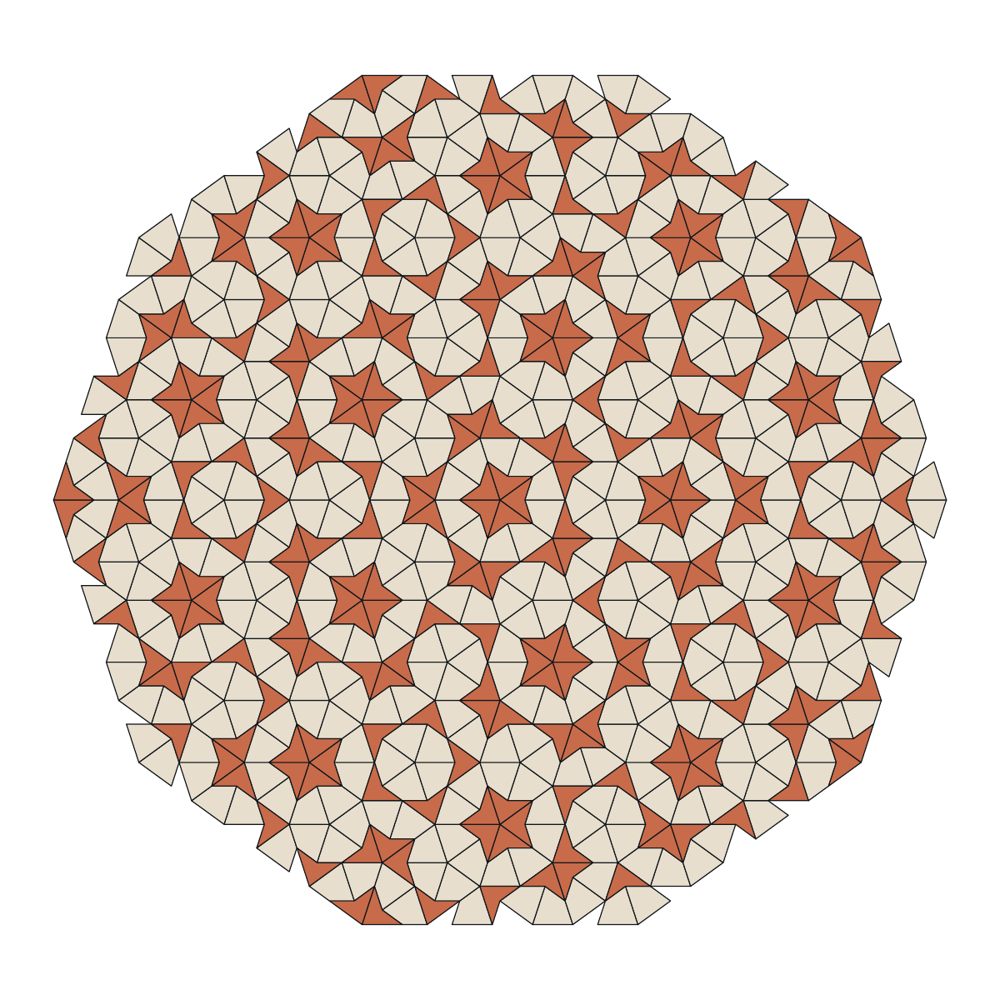
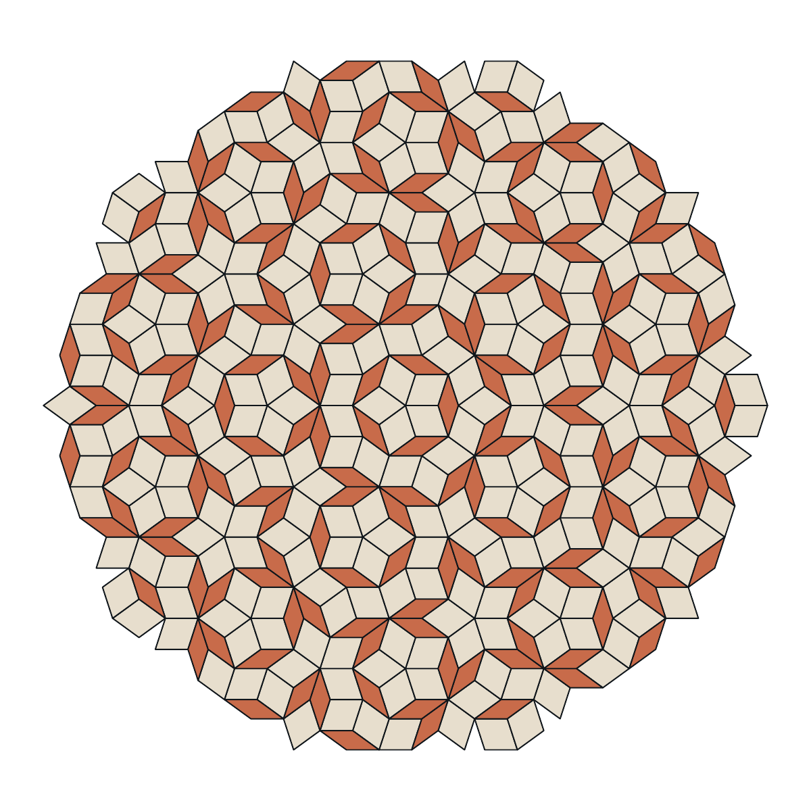

# aper

`aper` draws finite P2 and P3 Penrose tilings as PDF.

It is a small, dependency-free C++20 program for the shell. Deterministic,
native vector PDF goes to standard output; diagnostics go to standard error.

```sh
make
./aper > tiling.pdf
open tiling.pdf
```

## Use

```text
aper [-t p2|p3] [-n depth]
aper -h | --help
aper -V | --version
```

- `-t type` or `--tiling type` selects `p2` kite-and-dart or `p3` rhombs.
  The default is `p3`.
- `-n depth` or `--depth depth` sets the number of Robinson subdivisions,
  from 1 through 12.
  The default is 7.
- `-h` or `--help` prints a concise help message.
- `-V` or `--version` prints the version.

## P2 — kite and dart



```sh
./aper -t p2 -n 5 > p2.pdf
```

## P3 — rhombs



```sh
./aper -t p3 -n 5 > p3.pdf
```

The same arguments produce the same PDF, making `aper` suitable for scripts,
pipes, and generated documents.

## Build

A C++20 compiler and `make` are sufficient.

```sh
make
make check
make install PREFIX=/usr/local
```

The geometry and presentation are intentionally separate. A fixed ten-triangle
sun seed and family-specific Robinson substitution generate kites and darts or
thin and thick rhombs; their matching rules are implicit in the construction.
A compact PDF writer gives both families their final form.
