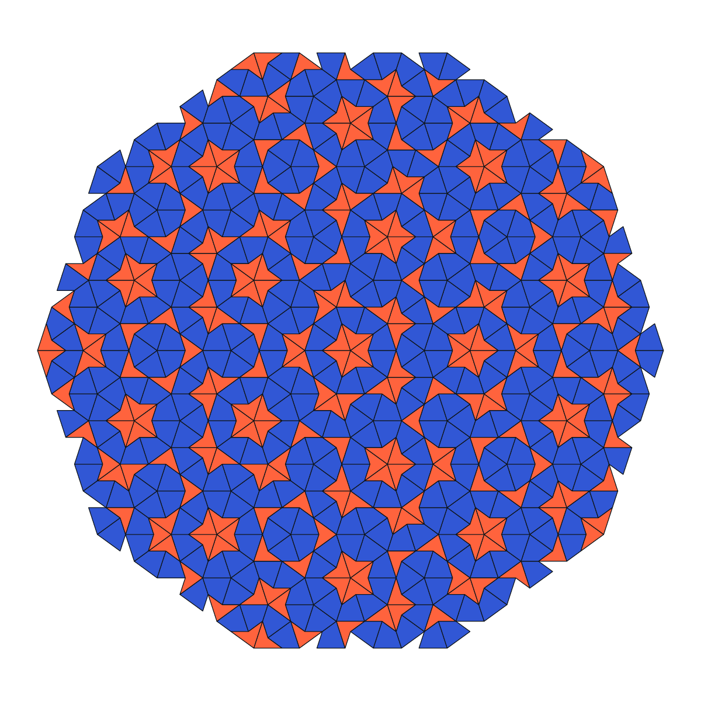
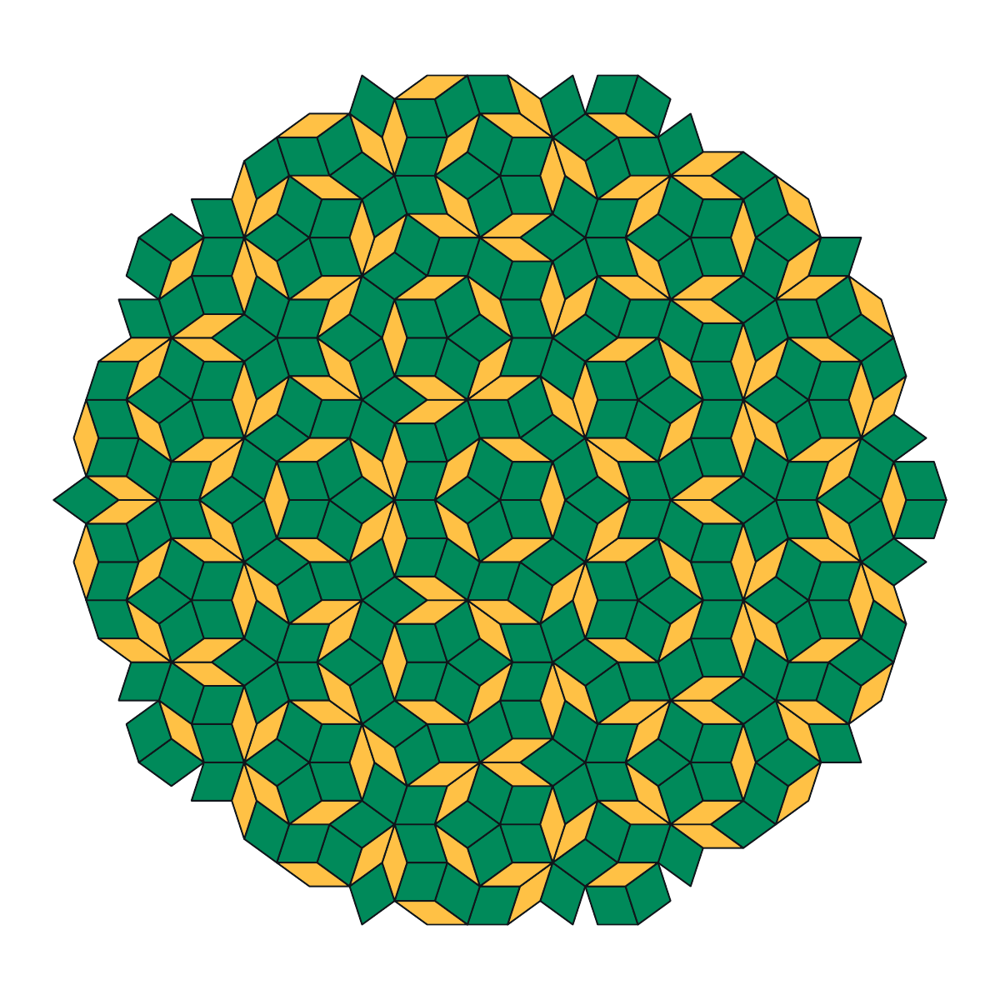
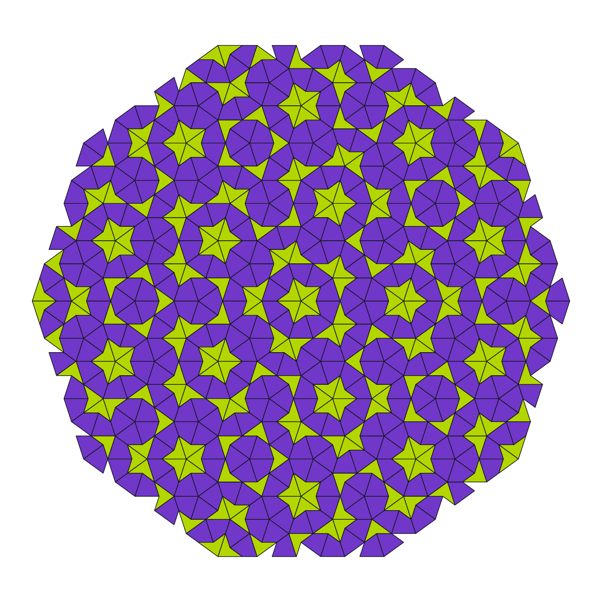
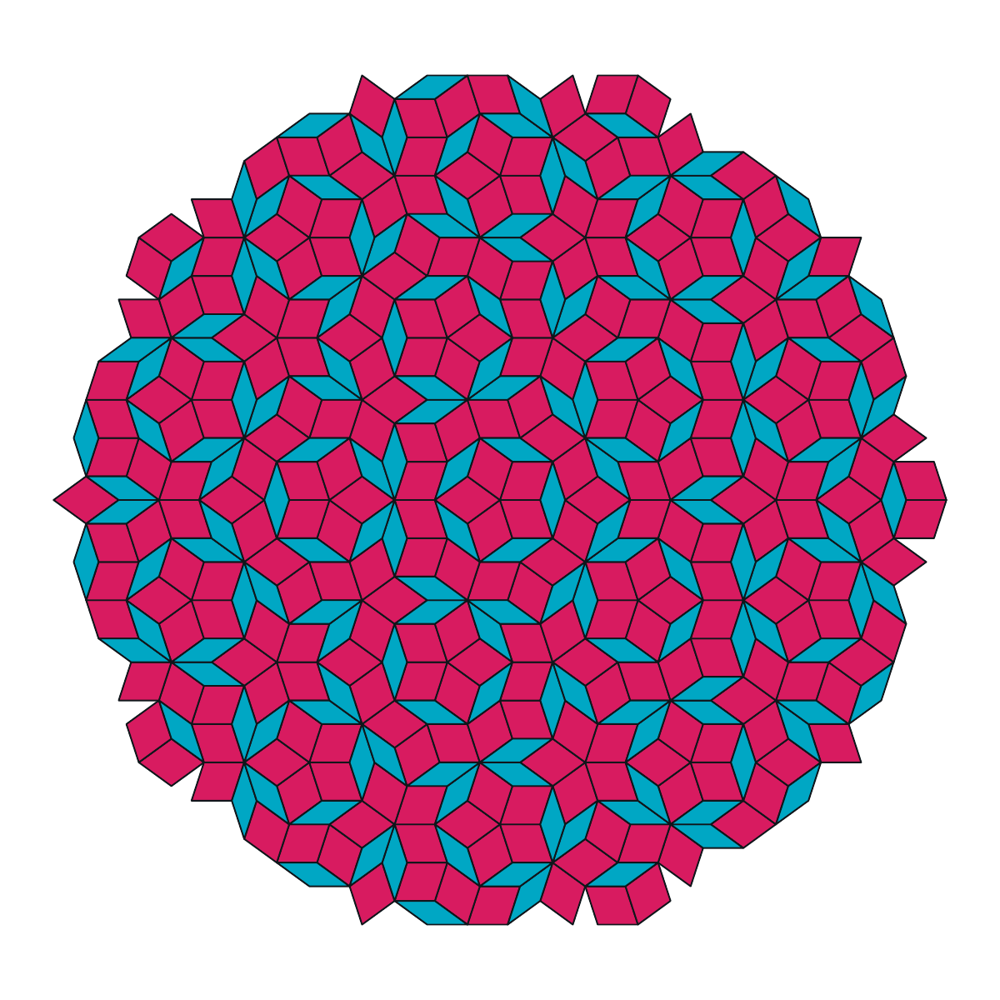

# aper

`aper` draws finite P2 and P3 Penrose tilings as PDF.

It is a small, dependency-free C++20 program for the shell. Deterministic,
native vector PDF goes to standard output; diagnostics go to standard error.

```sh
make
./aper > tiling.pdf
open tiling.pdf
```

## Use

```text
aper [-t p2|p3] [-c scheme] [-n depth]
aper -h | --help
aper -V | --version
```

- `-t type` or `--tiling type` selects `p2` kite-and-dart or `p3` rhombs.
  The default is `p3`.
- `-c scheme` or `--colour scheme` selects `flare`, `grove`, `electric`, or
  `tide`. The default is `flare`.
- `-n depth` or `--depth depth` sets the number of Robinson subdivisions,
  from 1 through 12.
  The default is 7.
- `-h` or `--help` prints a concise help message.
- `-V` or `--version` prints the version.

## Examples

| Flare · P2 | Grove · P3 |
| :---: | :---: |
|  |  |
| `./aper -t p2 -c flare -n 5 > flare.pdf` | `./aper -t p3 -c grove -n 5 > grove.pdf` |
| Electric · P2 | Tide · P3 |
|  |  |
| `./aper -t p2 -c electric -n 5 > electric.pdf` | `./aper -t p3 -c tide -n 5 > tide.pdf` |

`flare` pairs ultramarine with vermilion, `grove` emerald with marigold,
`electric` violet with citron, and `tide` raspberry with cyan. Every scheme
keeps white paper and near-black outlines.

The same arguments produce the same PDF, making `aper` suitable for scripts,
pipes, and generated documents.

## Build

A C++20 compiler and `make` are sufficient.

```sh
make
make check
make install PREFIX=/usr/local
```

The geometry and presentation are intentionally separate. A fixed ten-triangle
sun seed and family-specific Robinson substitution generate kites and darts or
thin and thick rhombs; their matching rules are implicit in the construction.
A compact PDF writer applies the selected colour scheme.
